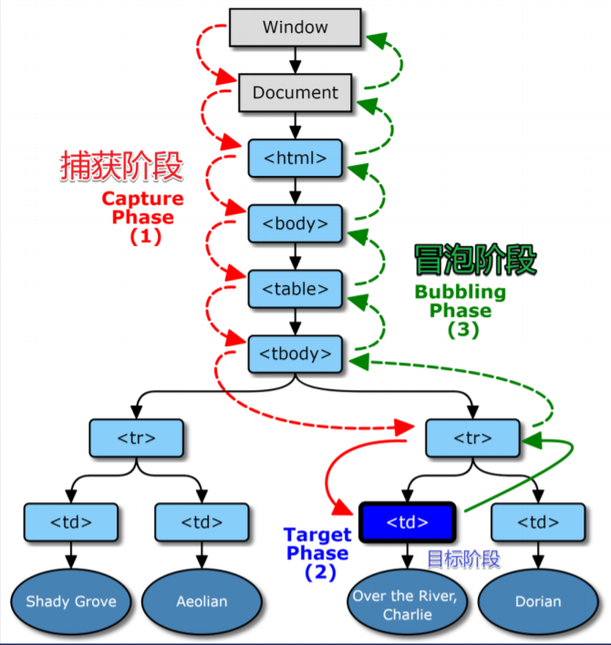

# Dom事件机制
### 事件的机制主要分为两种，事件捕获和事件冒泡，规定浏览器应该同时支持两种调用顺序，首先是按照捕获的顺序寻找有无监听函数，然后再按照冒泡的顺序寻找有无监听事件
## 1.事件捕获
* 从外向内找监听函数，叫事件捕获
## 2.事件冒泡
* 从内向外找监听函数，叫事件冒泡
### 由开发者自己选择将监听函数放在部捕获阶段还是冒泡阶段

* 主要调用的就是addEventListener(eventType,fn,bool)这函数，该函数有三个参数，第一个参数是事件类型，如'click'点击事件，第二个参数是函数，最重要的就是第三个参数，如果不传第三个参数或者值为falsy，则表示在冒泡阶段监听，若值为true则在捕获阶段里监听。下面举个例子
```JavaScript
  <!DOCTYPE html>
<html lang="en">
  <head>
    <meta charset="UTF-8" />
    <meta name="viewport" content="width=device-width, initial-scale=1.0" />
    <title>Document</title>
    <style>             
      .parent {
        position: relative;
        background-color: red;
        border: 1px solid;
        padding: 50px;
      }
      .child {
        position: relative;
        background-color: blue;
        width: 100px;
        height: 100px;
      }
    </style>
  </head>
  <body>
    <p>演示在添加事件监听时冒泡与捕获阶段的不同。</p>
    <div id="div1" class="parent">
      <div id="myDiv1" class="child">请点击,我是冒泡</div>
    </div>
    <br />
    <div id="div2" class="parent">
      <div id="myDiv2" class="child">请点击，我是捕获</div>
    </div>
    <script>
      document.querySelector("#myDiv1").addEventListener(
        "click",
        function () {
          alert("你点击了 蓝色!");
        },
        false
      );
      document.querySelector("#div1").addEventListener(
        "click",
        function () {
          alert("你点击了 红色!");
        },
        false
      );
      document.querySelector("#myDiv2").addEventListener(
        "click",
        function () {
          alert("你点击了 蓝色!");
        },
        true
      );
      document.querySelector("#div2").addEventListener(
        "click",
        function () {
          alert("你点击了 红色!");
        },
        true
      );
    </script>
  </body>
</html>
```
代码演示的结果是div1是冒泡事件，div2是捕获事件